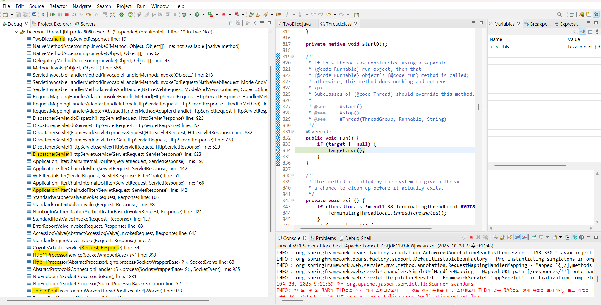

# 📚 학습 노트
> 작성일: 2025-10-28 
> 주제: Tomcat 구조

## 🧩 학습 개요
- Tomcat의 구조
- Tomcat이 요청받아서 구동하는 원리
  

## 🔍 핵심 개념 정리
1. 스레드 풀에서 대기중이던 스레드 하나가 실행된다
2. Service의 Connect 내부에 요청에 맞는 프로토콜이 실행된다 (ex: http1.1)
3. 엔진(카탈리나)내부의 HOST로 연결된다 (여러개의 HOST가 있을 수 있음)
4. HOST내 요청과 맞는 Context가 이를 받는다
5. (일련의 필터링 과정을 거친 후) 디스패처서블릿이 이를 받는다
6. url주소와 맞는 컨트롤러를 호출한다

